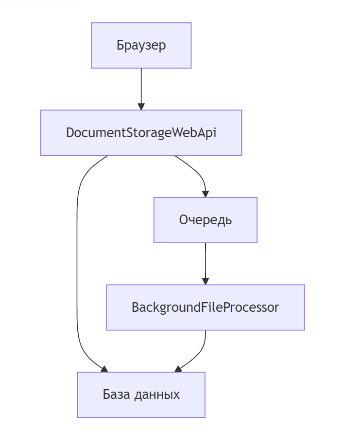
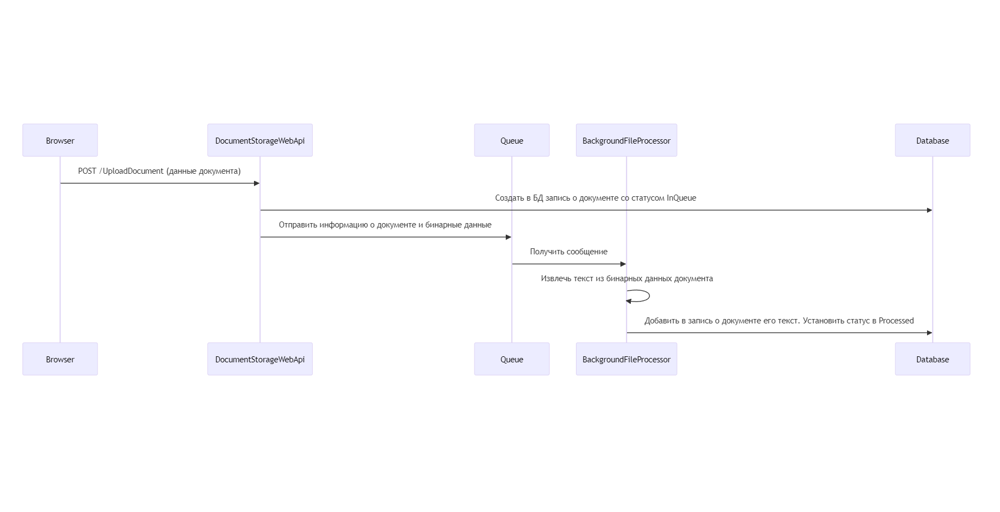
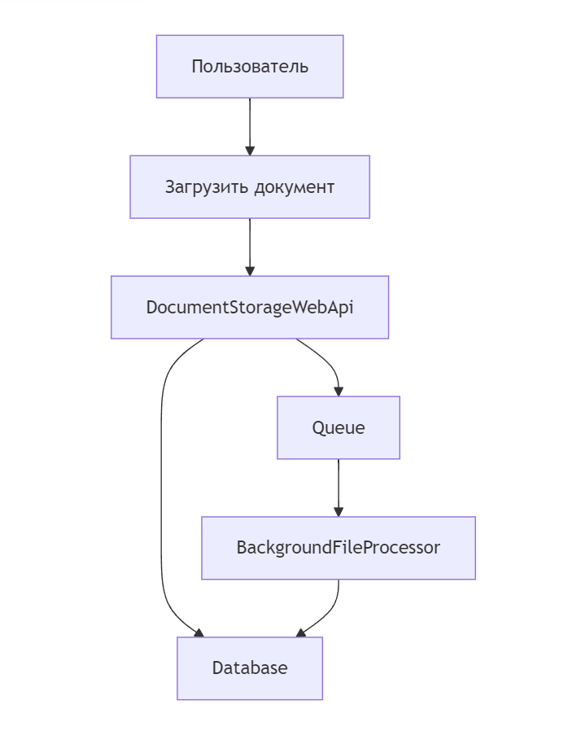
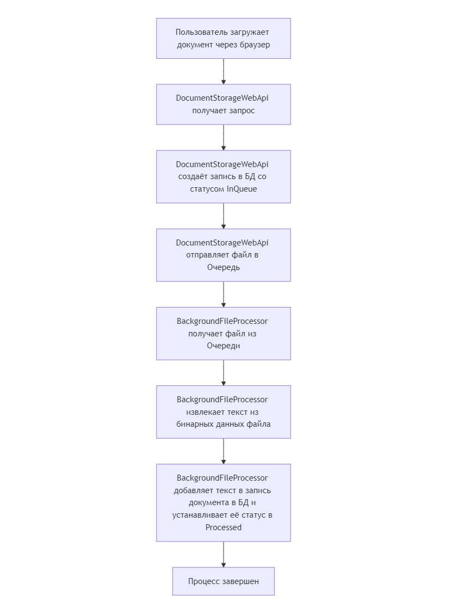

# DocumentsStorage

**DocumentsStorage** — это микросервисное приложение на платформе .NET для загрузки, хранения и асинхронной обработки PDF-документов. Система реализует паттерн «очередь сообщений» для разгрузки веб-API и фоновой обработки файлов.

---

## Содержание

- [Архитектура](#архитектура)
- [Основные компоненты](#основные-компоненты)
- [Диаграммы](#диаграммы)
- [Реализованные возможности](#реализованные-возможности)
- [Технологический стек](#технологический-стек)
- [Запуск проекта](#запуск-проекта)
- [Структура решения](#структура-решения)

---

## Архитектура

Система построена по принципу **асинхронной обработки сообщений**:

1. **Клиент** отправляет PDF-файл через REST API.
2. **Web API** сохраняет общую информацию о принятом файле в новой записи в БД PostgreSQL, публикует сообщение в очередь RabbitMQ и сразу возвращает ответ клиенту.
3. **Фоновый обработчик** подписан на очередь RabbitMQ, ассинхронно получает сообщение, извлекает текст из бинарных данных PDF, сохраняет текст в созданной в п.1 записи в БД PostgreSQL и обновляет статус обработки файла в данной записи.

```
Клиент → Web API → PostgreSQL + RabbitMQ → Фоновый обработчик → PostgreSQL
```

Такой подход обеспечивает:
- **отзывчивость API** — клиент не ждёт завершения обработки файла;
- **отказоустойчивость** — сообщения в очереди не теряются при сбоях;
- **масштабируемость** — можно запустить несколько экземпляров обработчика для параллельной обработки.

---

## Основные компоненты

### 1. `DocumentStorageWebApi` (ASP.NET Core Web API)

Веб-сервис REST API, предоставляющий точки доступа (endpoints) для:

- `GET /v{version}/DocumentFiles` — получение списка загруженных документов с поддержкой постраничной навигации и сортировки.
- `GET /v{version}/DocumentFiles/{id}` — получение информации о документе по идентификатору.
- `GET /v{version}/DocumentFiles/DocumentText/{id}` — получение текста документа (если документ уже обработан в Фоновом обработчике).
- `POST /v{version}/DocumentFiles/UploadDocument` — загрузка нового PDF-файла (multipart/form-data).

API документирован с помощью **Swagger/OpenAPI** и поддерживает версионирование через префиксы методов в URL.

### 2. `BackgroundFileProcessor` (Worker Service)

Фоновый сервис, реализованный как `BackgroundService`. Подписывается на очередь RabbitMQ, обрабатывает сообщения:

- Извлекает текст из PDF-файла с помощью библиотеки **PdfPig**;
- Сохраняет или обновляет запись в базе данных, устанавливая статус **Processed** и дату обработки.

### 3. `Contracts` (Библиотека интерфейсов)

Содержит контракты взаимодействия между компонентами:

| Интерфейс | Назначение |
|---|---|
| `IDocumentStorageRepository` | Абстракция/интерфейс доступа к хранилищу документов |
| `IDocumentProcessingQueueService` | Абстракция/интерфейс очереди сообщений (публикация/потребление) |
| `IPdfTextExtractor` | Абстракция/интерфейс извлечения текста из PDF |

Все зависимости регистрируются через DI-контейнер, что позволяет легко подменять реализации.

### 4. `Domain` (Модели предметной области)

Содержит основные сущности:

- `Document` — модель документа (Id, имя файла, тип, размер, статус обработки, извлечённый текст и др.)
- `DocumentFileType` — перечисление типов файлов (None, Pdf, Unknown)
- `DocumentProcessingStatus` — перечисление статусов обработки

### 5. `DTO` (Data Transfer Objects)

Набор структур обмена данными (DTO) для разделения слоёв приложения:

- `QueueDocumentDto` — передача данных через очередь
- `DocumentListItemDto` — отображение в списке документов
- `NewDocumentResponseDto` — ответ при создании документа

### 6. `Repository` (Слой доступа к данным)

Реализация `IDocumentStorageRepository` на **Entity Framework Core** с провайдером **Npgsql** для PostgreSQL. Включает конфигурацию сущностей (`DocumentConfiguration`), миграции базы данных и разбиение на страницы (pagination) через `IQueryableExtensions`.

### 7. `RabbitMqService` (Сервис очереди)

Реализация `IDocumentProcessingQueueService` на основе **RabbitMQ.Client**. Обеспечивает публикацию сообщений в очередь (приложением - источником данных) и их получение (приложением - потребителем данных).

### 8. `PdfService` (Сервис извлечения текста)

Реализация `IPdfTextExtractor` с на основе библиотеки **PdfPig** (UglyToad.PdfPig) для извлечения текстового содержимого из PDF-файлов.

### 9. `MappingProfiles` (Профили AutoMapper)

Настройка маппинга между DTO и доменными моделями с помощью **AutoMapper**.

### 10. `Common` (Общие утилиты)

Константы (`Constants.MaxDocumentSize`), настройки RabbitMQ (`RabbitMqOptions`).

### 11. `Tests` (Модульные тесты)

Набор тестовых проектов для каждого основного компонента:
- `DocumentStorageWebApi.Tests`
- `MappingProfiles.Tests`
- `PdfService.Tests`
- `RabbitMqService.Tests`
- `Repository.Tests`

---

## Диаграммы UML

Для наглядного представления архитектуры и взаимодействия компонентов в проект включены следующие диаграммы:

### Диаграмма компонентов (component diagram)


### Диаграмма последовательности (sequence diagram)


### Диаграмма вариантов использования (use case diagram)


### Диаграмма активности (activity diagram)


---

## Реализованные возможности

### Версионирование REST API
API поддерживает версионирование через префиксы в URL (`v1.0`, `v2.0` и т.д.) с помощью пакета **Microsoft.AspNetCore.Mvc.Versioning**. Версия указывается в маршруте: `/v{version}/DocumentFiles/...`. Swagger UI автоматически отображает все доступные версии API.

```csharp
// Пример: routes.MapControllerRoute() формирует /v1.0/DocumentFiles
[ApiVersion("1.0")]
[Route("v{v:apiVersion}/DocumentFiles")]
```

### Взаимодействие через интерфейсы (DI и слабая связанность)
Все ключевые зависимости вынесены в отдельный проект **Contracts** и регистрируются через встроенный DI-контейнер .NET. Это обеспечивает:
- Слабое связывание между компонентами
- Возможность лёгкой замены реализаций (например, RabbitMQ на другой брокер)
- Тестируемость — подмена зависимостей в юнит-тестах через mock-объекты

Пример регистрации в `Startup.cs`:
```csharp
services.AddScoped<IDocumentStorageRepository, DocumentStorageRepository>();
services.AddSingleton<IDocumentProcessingQueueService, RabbitMqService.RabbitMqService>();
```

### Асинхронная обработка через очередь сообщений
Загруженные PDF-файлы не обрабатываются синхронно в рамках HTTP-запроса. Вместо этого:
1. Web API сохраняет общую информацию о документе в БД и публикует сообщение в очередь RabbitMQ.
2. `BackgroundFileProcessor` асинхронно получает сообщение, извлекает текст, добавляет текст к общей информации о документе в БД и обновляет статус.
3. Клиентское приложение может отслеживать статус обработки документа через возвращённый ему в п1 URL REST метода.

### Логирование с NLog
Настроено структурированное логирование с помощью **NLog** в `DocumentStorageWebApi`.

### Маппинг с AutoMapper
Для преобразования между доменными моделями и DTO используется **AutoMapper**, что минимизирует шаблонный код и централизует правила маппинга в `MappingProfile.cs`.

### Контейнеризация
Все сервисы упакованы в Docker-контейнеры:
- **documentstorage-web-api** — ASP.NET Core Web API
- **background-file-processor** — фоновый обработчик
- **postgres:17-alpine** — база данных PostgreSQL
- **rabbitmq:management** — брокер сообщений RabbitMQ с веб-интерфейсом

### Модульное тестирование
Проект покрыт модульными тестами, которые проверяют:
- Работу контроллеров Web API
- Корректность маппинга DTO
- Извлечение текста из PDF
- Сервисы очереди
- Слой репозитория

---

## Технологический стек

| Технология | Назначение |
|---|---|
| **.NET 8** | Платформа разработки |
| **ASP.NET Core** | Веб-фреймворк |
| **Entity Framework Core + Npgsql** | ORM и провайдер PostgreSQL |
| **PostgreSQL 17** | База данных |
| **RabbitMQ** | Брокер сообщений |
| **UglyToad.PdfPig** | Извлечение текста из PDF |
| **AutoMapper** | Маппинг объектов |
| **NLog** | Логирование |
| **Swagger / Swashbuckle** | Документирование API |
| **xUnit** | Модульное тестирование |
| **Docker / Docker Compose** | Контейнеризация и оркестрация |

---

## Запуск проекта

### Предварительные требования

- [Docker Desktop](https://www.docker.com/products/docker-desktop/) (с поддержкой Compose V2)
- .NET 8 SDK (для разработки без Docker)

### Рекомендюется запускать solution установив в качестве стартового проекта docker-compose

```bash
# Клонировать репозиторий
git clone https://github.com/Babikoff/PdfStorage.git
cd DocumentStorage

# Собрать и запустить все сервисы
docker compose up --build
```

После запуска будут доступны:

| Сервис | Адрес |
|---|---|
| Web API (Swagger UI) | http://localhost:5000/swagger |
| RabbitMQ Management UI | http://localhost:15672 (логин: `rabbitmq`, пароль: `rabbitmq`) |

---

## Структура решения

```
DocumentsStorage.sln                 # Файл решения
├── DocumentStorageWebApi/            # ASP.NET Core Web API
│   ├── Controllers/                  # REST-контроллеры
│   ├── Swagger/                      # Конфигурация Swagger
│   ├── Program.cs                    # Точка входа
│   ├── Startup.cs                    # Конфигурация сервисов и middleware
│   └── Dockerfile                    # Docker-образ Web API
├── BackgroundFileProcessor/          # Фоновый обработчик
│   ├── Worker.cs                     # BackgroundService
│   ├── Program.cs                    # Точка входа
│   └── Dockerfile                    # Docker-образ обработчика
├── Contracts/                        # Интерфейсы (контракты)
├── Domain/                           # Доменные модели
├── DTO/                              # Data Transfer Objects
├── Repository/                       # Слой доступа к данным (EF Core)
├── RabbitMqService/                  # Реализация сервиса очереди
├── PdfService/                       # Реализация извлечения текста из PDF
├── MappingProfiles/                  # Профили AutoMapper
