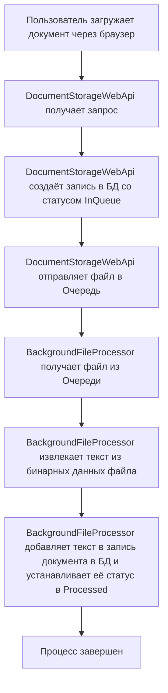

# Диаграмма активности

```mermaid
flowchart TD
    A[Пользователь загружает документ через браузер] --> B[DocumentStorageWebApi получает запрос]
    B --> C[DocumentStorageWebApi создаёт запись в БД со статусом InQueue]
    C --> D[DocumentStorageWebApi отправляет файл в Очередь]
    D --> E[BackgroundFileProcessor получает файл из Очереди]
    E --> F[BackgroundFileProcessor извлекает текст из бинарных данных файла]
    F --> G[BackgroundFileProcessor добавляет текст в запись документа в БД и устанавливает её статус в Processed]
    G --> H[Процесс завершен]
```