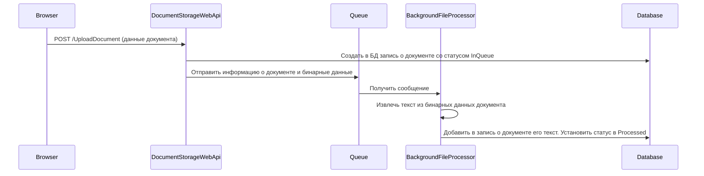

# Диаграмма последовательности

```mermaid
sequenceDiagram
    participant Браузер as Browser
    participant API as DocumentStorageWebApi
    participant Очередь as Queue
    participant Процессор as BackgroundFileProcessor
    participant БД as Database

    Браузер->>API: POST /UploadDocument (данные документа)
    API->>БД: Создать в БД запись о документе со статусом InQueue
    API->>Очередь: Отправить информацию о документе и бинарные данные
    Очередь->>Процессор: Получить сообщение
    Процессор->>Процессор: Извлечь текст из бинарных данных документа
    Процессор->>БД: Добавить в запись о документе его текст. Установить статус в Processed
```