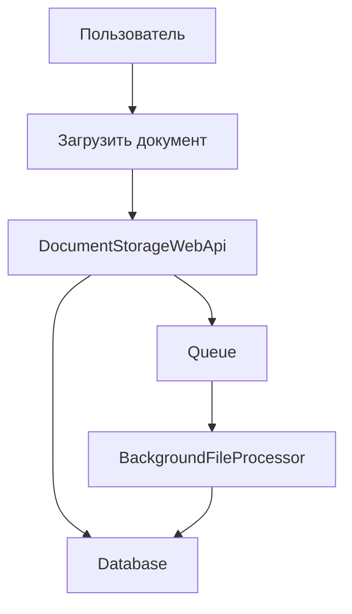

# Диаграмма вариантов использования

```mermaid
flowchart TD
    U[Пользователь] --> UC1[Загрузить документ]
    UC1 --> A[DocumentStorageWebApi]
    A --> DB[Database]
    A --> Q[Queue]
    Q --> P[BackgroundFileProcessor]
    P --> DB
```